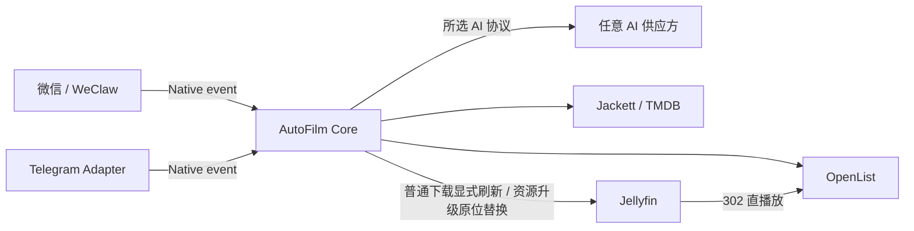

# AutoFilm Core

AutoFilm Core 是多人观影请求系统的业务服务和管理界面。聊天 Adapter
只负责收发消息；Core 负责成员权限、AI 协议、Agent 会话、媒体工具、下载任务和通知。

本仓库不包含软链接、rclone 挂载、Nginx 播放地址改写或旧版目录同步。这些职责已经由
修改版 Jellyfin 与 OpenList 的远端媒体能力取代。

## 当前能力

- 固定深色管理界面，视觉延续旧版 AutoFilm 的卡片、滑动标签和弹簧动效。
- 首次启动创建所有者，不提供默认账号或默认密码。
- 多成员、所有者/管理员/成员角色，以及聊天外部身份的审批与绑定。
- AI 供应方和协议分离：
  - OpenAI Responses，默认协议。
  - OpenAI Chat Completions，兼容旧接口。
  - Anthropic Messages。
  - Gemini GenerateContent。
- New API 可作为任意供应方配置，不是特殊代码路径。
- 主 Agent、影视主题摘要、验证码 OCR、字幕广告清理和追更判断提示词保存在 SQLite 中，可从
  管理界面修改并恢复当前版本的系统默认内容；修改在下一次模型请求时生效。
- 39 个常规 Agent 工具，覆盖 TMDB、Jackett、OpenList、Jellyfin、SubHD、
  ASS 样式和按成员追更；管理员聊天另有 OpenList 扫码工具。
- Jellyfin 电影按实际视频流分辨率分页查询，不访问 OpenList；重复电影分为
  Provider ID 确定重复和标题年份疑似重复，并返回每个实际版本的画质、音轨与路径。
- TMDB 电影、剧集整体、单季和单集评分、评分人数及剧情简介统一查询；中文简介
  缺失时返回明确标注的英文内容。
- TMDB 作品身份唯一确定后自动发送封面，渠道中的图片先于资源说明文字，便于成员
  直接核对作品。
- 同一成员会话的顶层请求按顺序执行，避免工具调用历史交叉；不同会话和同一轮工具
  仍可并行。
- 最近 80 条会话上下文按完整用户请求截取，不拆分工具调用与结果；历史中存在旧版
  孤立结果或进程中断时会在发送模型前自动恢复，同类供应方错误会使用当前请求重试。
- 每次模型请求都包含服务器当前时间；精确的播出、上映和相对日期判断仍要求 Agent
  调用时间工具。作品焦点切换时，上一作品的完整历史转换为可恢复摘要，原始消息保留。
- Jackett 完整结果按文件大小降序分页，同一搜索词复用短期缓存；同轮只读工具
  并行执行。
- SubHD 影片页完整字幕列表、详情评论、成员级多包临时工作区，以及 ZIP/RAR/7z
  多解压器和 GB18030/GBK/GB2312 编码归一化。
- 工作区字幕文件只使用不可变 UUID；Agent 先创建带文件摘要的最终映射计划，再执行
  批量放置。失败项可重试，成功项不会重复上传。
- 字幕与 Jellyfin Movie/Episode ID 配对；新增、替换和删除统一使用 Jellyfin
  字幕接口和摘要字幕引用，不向 Agent 暴露可变化的流序号。本地媒体由 Jellyfin
  写入本地目录，远端媒体由 Jellyfin 上传 OpenList。
- 文本字幕逐文件使用独立 AI 请求分析全部事件并清理广告；SUP/PGS 原样上传。
  同一放置计划最多并发处理 8 个映射，清理、流式上传和单项状态互相隔离。
- Jellyfin 当前图片、远程图片、图片设置、条目刷新、分集和媒体流查询。
- Jellyfin Movie/Episode 精确版本删除；Core 先核对条目、路径和媒体流，再通过
  Jellyfin 删除本地或 OpenList 实际文件。字幕删除继续使用不可变摘要引用。
- 现有 OpenList Movie/Episode 资源升级：最多 8 个目标一次提交，Jackett 查询、
  下载和替换按条目隔离并有限并发；每项下载完成后立即使用 Jellyfin 自身命名规则和
  ffprobe 结果替换原 Item ID，不执行普通媒体库导入。观看记录、收藏、Provider ID、
  图片和元数据保持不变，旧文件进入按升级项隔离的备份目录，并支持确认后恢复。
- 每个 SubHD 下载使用独立 session、Cookie Jar 和视觉模型请求；请求开始受间隔限制
  但可并发等待响应。自动识别五次后，使用独立任务码请求人工输入。
- 按成员保存追更条件，定时读取 TMDB 并使用只读 Agent 检查发布版本和字幕。
- OpenList 离线任务进度、持久化任务记录和聊天完成通知；115 秒传超过
  默认 40 秒会停止并删除本次离线任务，等待成员明确选择备用资源，不自动下载。
- 离线任务只有在 OpenList 返回 `StateSucceeded` 后才进入成功路径；Core 使用
  最终结果路径导入 Jellyfin，再由原聊天会话继续已经约定的可选字幕处理。没有
  字幕计划、已有合适内封字幕或成员不需要字幕时，直接完成视频入库。
- 下载目录由 Core 根据 TMDB ID、媒体类型和季号自动生成；单季进入
  `剧名/Sxx`，多季合集进入剧集根目录，Agent 不能自行指定最终目录。
- OpenList 115 扫码登录管理；二维码可从管理界面获取，管理员也可让 Agent
  通过聊天发送临时二维码。
- OpenList 真实请求返回 HTTP 405 时向所有已绑定管理员渠道发送一次通知；Core
  只读取 OpenList 本地标记，不主动访问 115。
- WeClaw 与独立 Telegram Adapter，共用 Native Message Service
  `2026-07-01` 协议和双向令牌认证；同一 Compose 内的 WeClaw 登录账号由
  Core 自动识别，不要求管理员填写 Bot ID、容器地址或令牌。
- Agent 回复中的 Core 临时媒体地址会转换为 Native 图片消息；微信和 Telegram
  收到实际图片，不显示 `http://autofilm-core:3100/v1/media/...` 容器地址。
- SQLite WAL 数据库和 AES-256-GCM 凭据加密。

## 系统结构



Core 每 2 秒读取一次 OpenList 的**内存任务管理器**，用于显示离线下载进度和
判断 115 秒传是否超过短时限；任务完成后，Core 按目标目录合并重复请求并显式
通知 Jellyfin 刷新。只有 Jellyfin 返回导入成功后，Core 才恢复原 Agent 会话并
发送最终结果。
该请求不列目录、不访问 115 文件对象，也不触发网盘刷新。

资源升级属于独立流程：升级任务下载到 `/115/autofilm-staging/upgrades/<item-id>`，
不会执行上述普通刷新。Core 在每项完成后读取实际视频文件，调用 Jellyfin 的替换
预检与应用接口更新原条目，再将旧文件移动到
`/115/autofilm-backups/upgrades/<item-id>`。详细说明见
[docs/media-upgrades.md](docs/media-upgrades.md)。

完整说明见 [docs/architecture.md](docs/architecture.md)。

六个源码仓库的上游、分支和修改边界见
[docs/system-repositories.md](docs/system-repositories.md)；容器、服务和用户操作之间
的通信方式见 [docs/communication.md](docs/communication.md)。

## 快速启动

仅启动 Core：

```bash
cp .env.example .env
# 设置 AUTOFILM_MASTER_KEY
docker compose pull
docker compose up -d
```

访问 `http://主机地址:3100`，按初始化页面创建所有者，再配置 AI 与媒体服务。

使用 GitHub Actions 发布的完整系统镜像：

```bash
cp .env.full.example .env
# 填写三个互不相同的随机令牌
docker compose -f compose.full.yaml --profile wechat pull
docker compose -f compose.full.yaml --profile wechat up -d
```

Telegram Adapter 默认随 Core 启动；在管理界面粘贴 BotFather Token 即可完成连接。
WeClaw 扫码成功后由 Core 自动登记微信账号；管理界面只显示连接状态和启用开关。
WeClaw 自己的账号、Agent 和联系人权限管理界面位于
`http://主机地址:18011`，首次访问需要创建独立管理员密码。

正式部署只需要 `autofilm-core` 仓库、`.env` 和持久化目录。完整镜像由 GitHub
Actions 构建，群晖只拉取 GHCR 镜像。进行跨仓库源码开发时，相关目录保持并列：

```text
autofilm-core/
autofilm-openlist/
autofilm-openlist-frontend/
autofilm-jellyfin/
autofilm-jellyfin-web/
autofilm-weclaw/
```

部署参数见 [docs/deployment.md](docs/deployment.md)，WeClaw 配置见
[docs/native-adapters.md](docs/native-adapters.md)，Telegram 配置见
[docs/telegram-adapter.md](docs/telegram-adapter.md)。

`.github/workflows/build-images.yml` 负责发布 Core、Telegram、OpenList、
Jellyfin 公共版/个人版和 WeClaw 的 `linux/amd64` GHCR 镜像。Core 源码变化自动
构建 Core 与 Telegram；其他组合镜像从 Actions 页面按组件和分支手动构建。

## 开发

要求 Node.js 22 或更高版本。

```bash
npm install
npm run dev
npm run typecheck
npm test
npm run build
```

后端默认监听 `3100`，Vite 开发服务器监听 `5173` 并代理 API。

## 项目文档

- [DETAILS.md](DETAILS.md)：目录与模块职责。
- [TODO.md](TODO.md)：真实开发状态和未完成事项。
- [docs/system-repositories.md](docs/system-repositories.md)：六个仓库、上游和修改边界。
- [docs/communication.md](docs/communication.md)：服务通信矩阵与用户交互流程。
- [docs/ai-providers.md](docs/ai-providers.md)：供应方与协议模型。
- [docs/conversation-recovery.md](docs/conversation-recovery.md)：会话截断、工具配对和
  供应方错误恢复。
- [docs/media-inventory-and-memory.md](docs/media-inventory-and-memory.md)：
  分辨率、重复电影、TMDB 分层详情、运行时间和影视主题摘要。
- [docs/media-upgrades.md](docs/media-upgrades.md)：现有条目资源查询、并发下载、
  原 Item ID 替换、备份与恢复。
- [docs/prompts.md](docs/prompts.md)：数据库提示词、默认版本和管理规则。
- [docs/native-adapters.md](docs/native-adapters.md)：聊天 Adapter 契约。
- [docs/openlist-jellyfin.md](docs/openlist-jellyfin.md)：媒体与任务交互。
- [docs/instant-offline-retry.md](docs/instant-offline-retry.md)：115 秒传短时失败和备用磁力。
- [docs/media-download-paths.md](docs/media-download-paths.md)：电影、单季与多季合集目录规则。
- [docs/telegram-adapter.md](docs/telegram-adapter.md)：Telegram 独立容器。
- [docs/subtitles-watchlists.md](docs/subtitles-watchlists.md)：字幕、验证码与追更。
- [docs/admin-ui.md](docs/admin-ui.md)：管理界面的旧版视觉基准与组件规则。
- [docs/security.md](docs/security.md)：凭据、权限和网络边界。

## 许可证

仓库许可证尚未指定。公开发布稳定版前需要明确许可证；在此之前保留全部权利。
