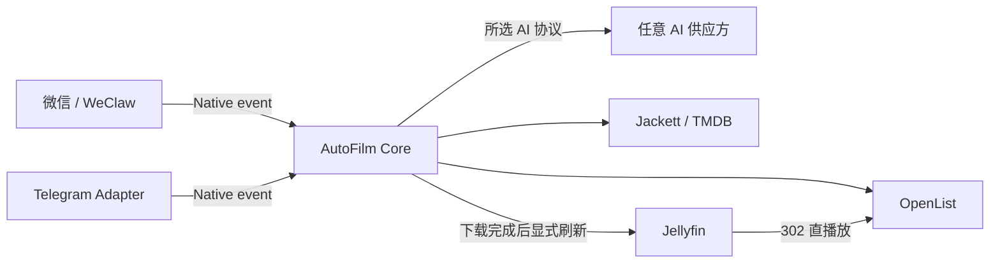

# AutoFilm Core

AutoFilm Core 是多人观影请求系统的业务服务和管理界面。聊天 Adapter
只负责收发消息；Core 负责成员权限、AI 协议、Agent 会话、媒体工具、下载任务和通知。

本仓库不包含软链接、rclone 挂载、Nginx 播放地址改写或旧版目录同步。这些职责已经由
修改版 Jellyfin 与 OpenList 的远端媒体能力取代。

## 当前能力

- 固定深色管理界面，视觉延续旧版 AutoFilm 的卡片、滑动标签和弹簧动效。
- 首次启动创建所有者，不提供默认账号或默认密码。
- 多成员、所有者/管理员/成员角色，以及聊天外部身份的审批与绑定。
- AI 供应方和协议分离：
  - OpenAI Responses，默认协议。
  - OpenAI Chat Completions，兼容旧接口。
  - Anthropic Messages。
  - Gemini GenerateContent。
- New API 可作为任意供应方配置，不是特殊代码路径。
- 主 Agent、验证码 OCR、字幕广告清理和追更判断提示词保存在 SQLite 中，可从
  管理界面修改并恢复当前版本的系统默认内容；修改在下一次模型请求时生效。
- 30 个常规 Agent 工具，覆盖 TMDB、Jackett、OpenList、Jellyfin、SubHD、
  ASS 样式和按成员追更；管理员聊天另有 OpenList 扫码工具。
- Jackett 完整结果按文件大小降序分页，同一搜索词复用短期缓存；同轮只读工具
  并行执行。
- SubHD 影片页完整字幕列表、详情评论、成员级多包临时工作区，以及 ZIP/RAR/7z
  多解压器和 GB18030/GBK/GB2312 编码归一化。
- 工作区字幕文件只使用不可变 UUID；Agent 先创建带文件摘要的最终映射计划，再执行
  批量放置。失败项可重试，成功项不会重复上传。
- 字幕与 Jellyfin Movie/Episode ID 配对；新增、替换和删除统一使用 Jellyfin
  字幕接口和摘要字幕引用，不向 Agent 暴露可变化的流序号。本地媒体由 Jellyfin
  写入本地目录，远端媒体由 Jellyfin 上传 OpenList。
- 文本字幕逐文件使用独立 AI 请求分析全部事件并清理广告；SUP/PGS 原样上传。
- Jellyfin 当前图片、远程图片、图片设置、条目刷新、分集和媒体流查询。
- 每个 SubHD 下载使用独立 session、Cookie Jar 和视觉模型请求；请求开始受间隔限制
  但可并发等待响应。自动识别五次后，使用独立任务码请求人工输入。
- 按成员保存追更条件，定时读取 TMDB 并使用只读 Agent 检查发布版本和字幕。
- OpenList 离线任务进度、持久化任务记录和聊天完成通知；115 秒传超过
  默认 20 秒会删除旧任务并自动尝试备用磁力。
- 下载目录由 Core 根据 TMDB ID、媒体类型和季号自动生成；单季进入
  `剧名/Sxx`，多季合集进入剧集根目录，Agent 不能自行指定最终目录。
- OpenList 115 扫码登录管理；二维码可从管理界面获取，管理员也可让 Agent
  通过聊天发送临时二维码。
- WeClaw 与独立 Telegram Adapter，共用 Native Message Service
  `2026-07-01` 协议和双向令牌认证；同一 Compose 内的 WeClaw 登录账号由
  Core 自动识别，不要求管理员填写 Bot ID、容器地址或令牌。
- Agent 回复中的 Core 临时媒体地址会转换为 Native 图片消息；微信和 Telegram
  收到实际图片，不显示 `http://autofilm-core:3100/v1/media/...` 容器地址。
- SQLite WAL 数据库和 AES-256-GCM 凭据加密。

## 系统结构



Core 每 2 秒读取一次 OpenList 的**内存任务管理器**，用于显示离线下载进度和
判断 115 秒传是否超过短时限；任务完成后，Core 按目标目录合并重复请求并显式
通知 Jellyfin 刷新。
该请求不列目录、不访问 115 文件对象，也不触发网盘刷新。

完整说明见 [docs/architecture.md](docs/architecture.md)。

## 快速启动

仅启动 Core：

```bash
cp .env.example .env
# 设置 AUTOFILM_MASTER_KEY
docker compose up -d --build
```

访问 `http://主机地址:3100`，按初始化页面创建所有者，再配置 AI 与媒体服务。

同时从相邻源码目录构建修改版 OpenList、Jellyfin、Jellyfin Web 和 WeClaw：

```bash
cp .env.full.example .env
# 填写三个互不相同的随机令牌
docker compose -f compose.full.yaml --profile wechat --profile search up -d --build
```

Telegram Adapter 默认随 Core 启动；在管理界面粘贴 BotFather Token 即可完成连接。
WeClaw 扫码成功后由 Core 自动登记微信账号；管理界面只显示连接状态和启用开关。
WeClaw 自己的账号、Agent 和联系人权限管理界面位于
`http://主机地址:18011`，首次访问需要创建独立管理员密码。

完整编排要求这些目录并列存在：

```text
autofilm-core/
autofilm-openlist/
autofilm-jellyfin/
autofilm-jellyfin-web/
autofilm-weclaw/
```

部署参数见 [docs/deployment.md](docs/deployment.md)，WeClaw 配置见
[docs/native-adapters.md](docs/native-adapters.md)，Telegram 配置见
[docs/telegram-adapter.md](docs/telegram-adapter.md)。

## 开发

要求 Node.js 22 或更高版本。

```bash
npm install
npm run dev
npm run typecheck
npm test
npm run build
```

后端默认监听 `3100`，Vite 开发服务器监听 `5173` 并代理 API。

## 项目文档

- [DETAILS.md](DETAILS.md)：目录与模块职责。
- [TODO.md](TODO.md)：真实开发状态和未完成事项。
- [docs/ai-providers.md](docs/ai-providers.md)：供应方与协议模型。
- [docs/prompts.md](docs/prompts.md)：数据库提示词、默认版本和管理规则。
- [docs/native-adapters.md](docs/native-adapters.md)：聊天 Adapter 契约。
- [docs/openlist-jellyfin.md](docs/openlist-jellyfin.md)：媒体与任务交互。
- [docs/instant-offline-retry.md](docs/instant-offline-retry.md)：115 秒传短时失败和备用磁力。
- [docs/media-download-paths.md](docs/media-download-paths.md)：电影、单季与多季合集目录规则。
- [docs/telegram-adapter.md](docs/telegram-adapter.md)：Telegram 独立容器。
- [docs/subtitles-watchlists.md](docs/subtitles-watchlists.md)：字幕、验证码与追更。
- [docs/admin-ui.md](docs/admin-ui.md)：管理界面的旧版视觉基准与组件规则。
- [docs/security.md](docs/security.md)：凭据、权限和网络边界。

## 许可证

仓库许可证尚未指定。公开发布稳定版前需要明确许可证；在此之前保留全部权利。
