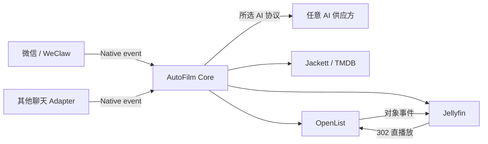

# AutoFilm Core

AutoFilm Core 是多人观影请求系统的业务服务和管理界面。聊天 Adapter
只负责收发消息；Core 负责成员权限、AI 协议、Agent 会话、媒体工具、下载任务和通知。

本仓库不包含软链接、rclone 挂载、Nginx 播放地址改写或旧版目录同步。这些职责已经由
修改版 Jellyfin 与 OpenList 的远端媒体能力取代。

## 当前能力

- 深色/浅色管理界面，视觉延续旧版 AutoFilm 的卡片、标签页和简洁动效风格。
- 首次启动创建所有者，不提供默认账号或默认密码。
- 多成员、所有者/管理员/成员角色，以及聊天外部身份的审批与绑定。
- AI 供应方和协议分离：
  - OpenAI Responses，默认协议。
  - OpenAI Chat Completions，兼容旧接口。
  - Anthropic Messages。
  - Gemini GenerateContent。
- New API 可作为任意供应方配置，不是特殊代码路径。
- TMDB、Jackett、OpenList 和 Jellyfin 工具。
- OpenList 离线任务进度、持久化任务记录和聊天完成通知。
- OpenList 115 扫码登录管理；二维码可从管理界面获取，管理员也可让 Agent
  通过聊天发送临时二维码。
- WeClaw Native Message Service `2026-07-01` 协议和双向令牌认证。
- SQLite WAL 数据库和 AES-256-GCM 凭据加密。

## 系统结构



OpenList 向 Jellyfin 发送精确对象事件，不由 Core 每 15 秒扫描文件。Core
每 15 秒读取一次 OpenList 的**内存任务管理器**，仅用于显示离线下载进度；
该请求不列目录、不访问 115 文件对象，也不触发网盘刷新。

完整说明见 [docs/architecture.md](docs/architecture.md)。

## 快速启动

仅启动 Core：

```bash
cp .env.example .env
# 设置 AUTOFILM_MASTER_KEY
docker compose up -d --build
```

访问 `http://主机地址:3100`，按初始化页面创建所有者，再配置 AI 与媒体服务。

同时从相邻源码目录构建修改版 OpenList、Jellyfin、Jellyfin Web 和 WeClaw：

```bash
cp .env.full.example .env
# 填写三个互不相同的随机令牌
docker compose -f compose.full.yaml --profile wechat --profile search up -d --build
```

完整编排要求这些目录并列存在：

```text
autofilm-core/
autofilm-openlist/
autofilm-jellyfin/
autofilm-jellyfin-web/
autofilm-weclaw/
```

部署参数见 [docs/deployment.md](docs/deployment.md)，WeClaw 配置见
[docs/native-adapters.md](docs/native-adapters.md)。

## 开发

要求 Node.js 22 或更高版本。

```bash
npm install
npm run dev
npm run typecheck
npm test
npm run build
```

后端默认监听 `3100`，Vite 开发服务器监听 `5173` 并代理 API。

## 项目文档

- [DETAILS.md](DETAILS.md)：目录与模块职责。
- [TODO.md](TODO.md)：真实开发状态和未完成事项。
- [docs/ai-providers.md](docs/ai-providers.md)：供应方与协议模型。
- [docs/native-adapters.md](docs/native-adapters.md)：聊天 Adapter 契约。
- [docs/openlist-jellyfin.md](docs/openlist-jellyfin.md)：媒体与任务交互。
- [docs/security.md](docs/security.md)：凭据、权限和网络边界。

## 许可证

仓库许可证尚未指定。公开发布稳定版前需要明确许可证；在此之前保留全部权利。
