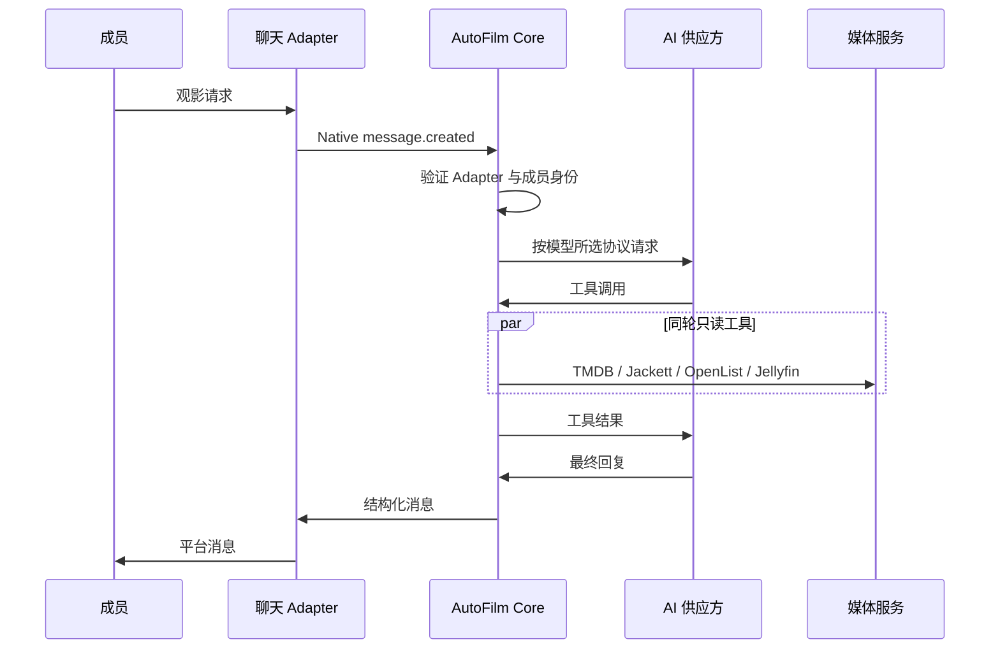

# Architecture

Updated: 2026-07-31

## 职责

AutoFilm Core 只处理业务状态：

- 成员、角色和聊天外部身份。
- AI 供应方、协议和模型。
- Agent 会话与工具权限。
- 下载任务、进度和通知。
- OpenList、Jellyfin、Jackett、TMDB、SubHD 的 API 调用。
- 字幕临时处理和按成员追更。
- Jellyfin 电影版本清单、重复项分析和影视主题摘要。

聊天 Adapter 处理平台登录、加密媒体和消息投递。OpenList
处理网盘驱动、Cookie、限速、文件操作与显式扫描。Jellyfin 处理媒体元数据、播放和
用户历史。

## 入站消息

Jackett 搜索先取得完整结果并按文件大小降序排列，再以每页 20 条返回。
相同搜索词的后续页使用 Core 短期内存缓存，不重新请求全部索引器。Core 不对发布
版本执行固定质量评分，具体选择继续由 Agent 根据标题、来源、编码、音轨和字幕判断。

新聊天身份先保存为 `pending`，Core 返回未授权提示。管理员绑定成员并改为
`active` 后才能进入 Agent。

## 下载与媒体更新

下载工具只接收媒体类型、TMDB ID 和资源包含的季号，不接收模型填写的最终目录。
Core 按 OpenList 服务中配置的电影/电视剧根目录计算路径：电视剧单季进入
`剧名/Sxx`，多季合集进入剧集根目录。详细规则见
[media-download-paths.md](media-download-paths.md)。

下载创建后，Core 保存 OpenList 内存任务 ID。进度 Worker 每 2 秒读取
受限的 `/api/autofilm/offline-tasks`。该端点读取 OpenList 进程内任务对象，
不会调用 115 列目录接口。115 秒传任务失败或超过默认 40 秒时，Core
通过受限删除接口让 OpenList 删除 115 离线任务，然后通知成员选择尚未尝试的
备用资源；收到成员明确选择前不会提交备用资源。Jackett 搜索只向 Agent 返回候选 ID
和原始标题。Core 选中候选后在内网读取 `.torrent` 并转换为 v1 magnet，OpenList
不接收 Jackett 内网 URL。
任务真实结束后，OpenList 同一快照返回 115 最终生成的 `result_path`；Core 只将
这个精确路径交给 Jellyfin。电影任务同时提供 TMDB ID 和
`provider_target=movie`，使 Jellyfin 将身份绑定到结果目录中的单个视频。旧版
OpenList 未提供结果路径时才使用原有刷新目标。

任务完成后，Core 按 Jellyfin 刷新目录合并同一批次的请求，调用
`RemoteRefresh`。电视剧统一刷新剧集根目录并携带 TMDB ID；失败状态保存在
任务元数据中，并按退避间隔重试。Jellyfin 导入完成后，Core 向原会话写入后台
事件，Agent 继续此前已经约定的字幕操作；没有字幕计划时只报告视频入库。
OpenList 普通文件变更不会自动修改 Jellyfin。

OpenList 只在真实 115 请求返回 HTTP 405 时记录风控状态，不执行定时 Cookie
校验。Core 每分钟读取一次 OpenList 进程内和数据库中的状态；这次读取不会访问
115。发现新的 405 标记后，Core 将通知发给所有已启用渠道中已经绑定的
owner/admin 身份。同一次标记只发送一次；扫码成功或后续真实 115 请求成功后，
OpenList 清除标记，Core 也允许后续新的 405 再次发送通知。

任务进入完成、失败或取消状态时，Core 写入 Outbox。主动消息 Worker
以指数退避向原聊天 Adapter 发送结果，因此 Adapter 暂时离线不会丢失通知。

## 数据

SQLite 使用 WAL、外键和版本迁移。Jellyfin 和 OpenList 的既有数据库不迁入
Core；它们继续保留媒体条目、播放历史、存储和文件状态。Core 只保存新业务数据。

字幕下载包、验证码和待放置文件不是长期业务数据。每个成员任务使用一个可累计多个
压缩包的 workspace，进程内状态保存文件 UUID、来源、完整相对目录和不可变 Jellyfin
映射计划，文件位于 `/data/tmp/subtitles`；过期、全部放置成功或重启后删除。
验证码按成员、workspace 和下载请求隔离。每个 SubHD 下载还具有独立 session 与
Cookie Jar，请求开始遵守统一间隔，但不同任务可以同时等待网络和 OCR 响应。追更条件
与分集状态需要跨重启保留，因此存入 Core SQLite。

会话原始消息始终保存在 `messages`。当前影视主题使用 TMDB ID 标识；Agent 明确
切换作品后，Core 使用独立无工具请求生成上一主题摘要，保存到
`conversation_topic_summaries`。发给模型的历史由较早主题摘要、当前主题完整消息和
当前服务器时间组成。摘要不删除原始消息，也不拆分一次工具调用及其结果。

Telegram 与 WeClaw 都在独立 Adapter 进程中。Telegram Adapter 使用 long polling，
Core 只接收统一事件并通过统一 `/v1/messages` 接口发送结果。
