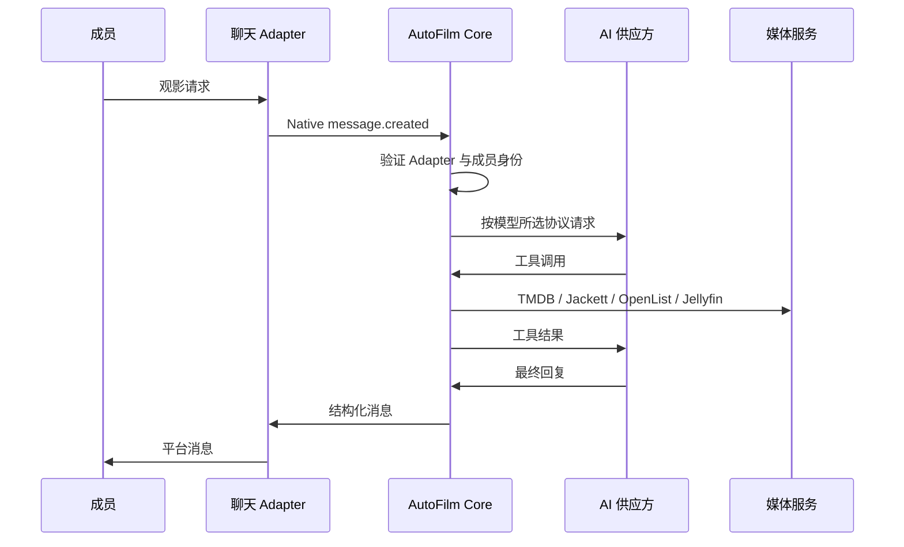

# Architecture

Updated: 2026-07-28

## 职责

AutoFilm Core 只处理业务状态：

- 成员、角色和聊天外部身份。
- AI 供应方、协议和模型。
- Agent 会话与工具权限。
- 下载任务、进度和通知。
- OpenList、Jellyfin、Jackett、TMDB 的 API 调用。

聊天 Adapter 处理平台登录、加密媒体和消息投递。OpenList
处理网盘驱动、Cookie、限速与文件事件。Jellyfin 处理媒体元数据、播放和用户历史。

## 入站消息

新聊天身份先保存为 `pending`，Core 返回未授权提示。管理员绑定成员并改为
`active` 后才能进入 Agent。

## 下载与媒体更新

下载创建后，Core 保存 OpenList 内存任务 ID。进度 Worker 每 15 秒读取
`/api/admin/task/offline_download/*`。这些端点读取 OpenList 进程内任务对象，
不会调用 115 列目录接口。

文件出现后由 OpenList 的对象事件直接通知 Jellyfin。Core 不轮询文件路径，
也不替代 OpenList 到 Jellyfin 的事件投递。

任务进入完成、失败或取消状态时，Core 写入 Outbox。主动消息 Worker
以指数退避向原聊天 Adapter 发送结果，因此 Adapter 暂时离线不会丢失通知。

## 数据

SQLite 使用 WAL、外键和版本迁移。Jellyfin 和 OpenList 的既有数据库不迁入
Core；它们继续保留媒体条目、播放历史、存储和文件状态。Core 只保存新业务数据。
