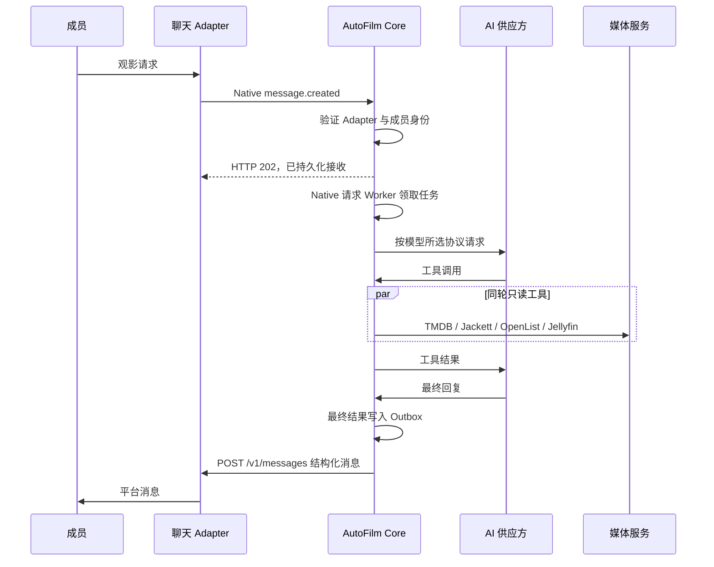

# Architecture

Updated: 2026-08-15

## 职责

AutoFilm Core 只处理业务状态：

- 成员、角色和聊天外部身份。
- AI 供应方、协议和模型。
- Agent 会话与工具权限。
- 下载任务、进度和通知。
- OpenList、Jellyfin、Jackett、TMDB、SubHD 的 API 调用。
- 字幕临时处理和按成员追更。
- Jellyfin 电影版本清单、重复项分析和 Pi 式滚动会话检查点。

聊天 Adapter 处理平台登录、加密媒体和消息投递。OpenList
处理网盘驱动、Cookie、限速、文件操作与显式扫描。Jellyfin 处理媒体元数据、播放和
用户历史。

## 入站消息

Jackett 搜索先取得完整结果并按文件大小降序排列，再以每页 20 条返回。
相同搜索词的后续页使用 Core 短期内存缓存，不重新请求全部索引器。Core 不对发布
版本执行固定质量评分，具体选择继续由 Agent 根据标题、来源、编码、音轨和字幕判断。

新聊天身份先保存为 `pending`，Core 返回未授权提示。管理员绑定成员并改为
`active` 后才能进入 Agent。

已绑定成员的 Native 请求不会在入站 HTTP 连接中等待 Agent。Core 认证、去重并写入
SQLite 后返回 `202`，后台 Worker 执行模型重试和工具操作，最终通过 Outbox 主动发送。
因此 Adapter 的请求超时只限制接收阶段，不限制完整 Agent 或字幕处理时长。

## 下载与媒体更新

下载工具只接收媒体类型、TMDB ID 和资源包含的季号，不接收模型填写的最终目录。
Core 按 OpenList 服务中配置的电影/电视剧根目录计算路径：电视剧单季进入
`剧名/Sxx`，多季合集进入剧集根目录。详细规则见
[media-download-paths.md](media-download-paths.md)。

下载创建后，Core 保存 OpenList 内存任务 ID。OpenList 成功调用 115 后，再公开
provider task ID 和 provider 接受时间。进度 Worker 每 2 秒读取受限的
`/api/autofilm/offline-tasks`。该端点读取 OpenList 进程内任务对象，不会调用 115
列目录接口。Agent 工具同时等待 provider task ID，只有接受或明确失败两种返回结果；
等待 60 秒仍未提交时取消本地任务。默认 40 秒从 provider 接受时间开始计算；115
未接受前不会触发完成超时。任务失败或 provider 接受后超过时限时，Core 通过受限
删除接口让 OpenList
删除对应离线任务，然后通知成员选择尚未尝试的备用资源；收到成员明确选择前不会提交
备用资源。Jackett 搜索只向 Agent 返回候选 ID
和原始标题。Core 选中候选后在内网读取 `.torrent` 并转换为 v1 magnet，OpenList
不接收 Jackett 内网 URL。
任务真实结束后，OpenList 同一快照返回 115 最终生成的 `result_path`；Core 只将
这个精确路径交给 Jellyfin。电影和电视剧任务同时提供 TMDB ID 以及
`provider_target=movie|series`。Jellyfin 先核对通知类型与媒体库类型，再将身份
绑定到 Movie 或 Series；类型冲突时拒绝导入，不把 ID 写给错误条目。旧版
OpenList 未提供结果路径时才使用原有刷新目标。

任务完成后，Core 按 Jellyfin 刷新目录合并同一批次的请求，调用
`RemoteRefresh`。电视剧统一刷新剧集根目录并携带 TMDB ID 与 Series 类型；失败状态保存在
任务元数据中，并按退避间隔重试。Jellyfin 导入完成后，Core 向原会话写入后台
事件，Agent 继续此前已经约定的字幕操作；没有字幕计划时只报告视频入库。
OpenList 普通文件变更不会自动修改 Jellyfin。

OpenList 只在真实 115 请求返回 HTTP 405 时记录风控状态，不执行定时 Cookie
校验。Core 每分钟读取一次 OpenList 进程内和数据库中的状态；这次读取不会访问
115。发现新的 405 标记后，Core 创建一个扫码会话，并将同一张二维码发给所有
已启用渠道中已经绑定的 owner/admin 身份。同一次标记只发送一次；扫码成功或
后续真实 115 请求成功后，
OpenList 清除标记，Core 也允许后续新的 405 再次发送通知。

Native Agent 回复以及任务进入完成、失败或取消状态时，Core 写入 Outbox。主动消息 Worker
以指数退避向原聊天 Adapter 发送结果，因此 Adapter 暂时离线不会丢失通知。

## 数据

SQLite 使用 WAL、外键和版本迁移。Jellyfin 和 OpenList 的既有数据库不迁入
Core；它们继续保留媒体条目、播放历史、存储和文件状态。Core 只保存新业务数据。

字幕下载包、验证码和待处理文件不是长期业务数据。每个成员任务使用一个可累计多个
SubHD 压缩包或 OpenList 现有字幕的 workspace，进程内状态保存文件 UUID、来源、完整
相对目录、不可变 Jellyfin 映射计划和逐项处理状态，文件位于 `/data/tmp/subtitles`；
过期、全部下载字幕放置成功或重启后删除。现有字幕大陆用词转换完成后，工作区保留到
过期，以便同一批文件查询状态或跳过重复执行。
验证码按成员、workspace 和下载请求隔离。每个 SubHD 下载还具有独立 session 与
Cookie Jar，请求开始遵守统一间隔，但不同任务可以同时等待网络和 OCR 响应。追更条件
与分集状态需要跨重启保留，因此存入 Core SQLite。

会话原始消息和工具原始结果始终保存在 `messages`。主 Agent 只使用 Pi 式滚动上下文：
较早消息前缀由 `conversation_compactions` 中的唯一检查点替代，近期消息按 Token 预算
保留原文。默认在距离模型窗口 16,384 Token 时触发压缩，并保留约 20,000 Token 的
近期原始历史。工具输出预算只限制模型视图，不覆盖数据库原文。

`agent.main`、当前服务器时间和当前成员长期记忆在每次主模型调用时重新注入，不写入
压缩检查点。项目不维护影视主题摘要、固定消息条数截断或额外用户原话副本。详细规则
见 `docs/context-management.md`。

Telegram 与 WeClaw 都在独立 Adapter 进程中。Telegram Adapter 使用 long polling，
Core 只接收统一事件并通过统一 `/v1/messages` 接口发送结果。
