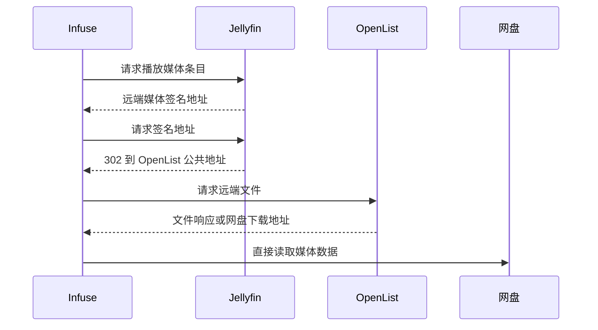

# Communication and interaction model

Updated: 2026-07-30

本系统只使用 HTTP、Docker DNS、SQLite 和本地挂载目录。容器之间不使用固定
局域网 IP；宿主机端口和公开域名只供浏览器、Infuse 和反向代理访问。

## 通信矩阵

| 调用方 | 接收方 | 方式 | 认证 | 用途 |
| --- | --- | --- | --- | --- |
| 浏览器 | Core | HTTP/HTTPS JSON | 管理会话 Cookie | 管理成员、AI、渠道、服务、任务和提示词 |
| WeClaw | Core | Native Message Service HTTP | Adapter → Core 令牌 | 微信消息、图片和会话重置 |
| Telegram Adapter | Core | Native Message Service HTTP | Adapter → Core 令牌 | Telegram 消息、图片和会话重置 |
| Core | WeClaw/Telegram | `POST /v1/messages` | Core → Adapter 令牌 | Agent 回复、任务通知、二维码 |
| Core | AI 供应方 | 配置的 AI HTTPS 协议 | 供应方 API Key | 文本、视觉、工具调用和字幕清理 |
| Core | TMDB | HTTPS API | TMDB Token 或 API Key | 影片、季和分集元数据 |
| Core | Jackett | HTTP API | Jackett API Key | 资源搜索和分页 |
| Jackett | FlareSolverr | Jackett 内部配置 | 由 Jackett 管理 | 处理部分索引器的反爬页面 |
| Core | SubHD | HTTPS + 每任务 Cookie Jar | 站点 Session/验证码 | 字幕搜索、详情、下载 |
| Core | OpenList | `/api/autofilm` HTTP | 受限服务令牌 | 文件、离线任务、扫码和风控状态 |
| Core | Jellyfin | Jellyfin HTTP API | Jellyfin API Key | 搜索条目、远端刷新、图片和字幕 |
| Jellyfin | OpenList | 受限 HTTP API | 独立服务令牌 | 远端视频、字幕、上传和删除 |
| OpenList | Jellyfin | 显式扫描 HTTP API | Jellyfin API Key | 管理员手动将目录加入 Jellyfin |
| Infuse/客户端 | Jellyfin | Jellyfin API | Jellyfin 用户会话 | 媒体库、播放、字幕和删除 |
| Jellyfin | Infuse/客户端 | HTTP 302 或文件响应 | 签名短期地址 | 远端直播放、本地/远端字幕 |
| OpenList | 115/其他存储 | 对应网盘驱动 | Storage 自身凭据 | 文件和离线下载 |

双向 Adapter 令牌必须不同。OpenList 给 Core 与 Jellyfin 使用的服务令牌也不能
与 Jellyfin API Key 复用。

## 容器内地址

完整 Compose 使用名为 `autofilm` 的 Docker 网络：

```text
Core -> OpenList            http://openlist:5244
Core -> Jellyfin            http://jellyfin:8096
Core -> WeClaw              http://weclaw:18011
Core -> Telegram Adapter    http://telegram-adapter:18012
Core -> Compose Jackett     http://jackett:9117
Jellyfin -> OpenList        http://openlist:5244
OpenList -> Jellyfin        http://jellyfin:8096
```

已有的外部 Jackett 和 FlareSolverr 不必加入该 Compose；Core 可使用管理界面保存
它们在宿主机或其他 Docker 网络中的可访问地址。

## 观影请求

1. 成员在微信、Telegram 或其他 Adapter 中发送请求。
2. Adapter 把平台消息转换为统一 Native 事件。
3. Core 校验 Adapter、外部身份和成员权限。
4. Core 调用选定模型。模型可在同一轮并行搜索 TMDB、Jackett 和 SubHD。
5. Jackett 返回完整结果；Core 只按文件大小降序分页，不写死质量评分和过滤规则。
6. Agent 选择资源后，Core 根据 TMDB ID、媒体类型和季号计算 OpenList 目标目录。
7. OpenList 创建离线任务；Core 每 2 秒读取 OpenList 内存任务状态。
8. 115 秒传超过短时限时，OpenList 删除失败任务，Core 尝试下一个候选磁力。
9. 完成后 Core 显式调用 Jellyfin `RemoteRefresh`，并通过原 Adapter 通知成员。

第 7 步不列举网盘目录，也不是文件同步。普通文件变更与 Jellyfin 无关。

## 播放



本地媒体仍由 Jellyfin 原生读取。远端媒体不经过 Jellyfin 转码，也不需要 rclone、
软链接或独立 Nginx 地址改写。

## 字幕

1. Agent 在一个临时 workspace 中下载一个或多个字幕包。
2. 每次下载使用独立 Session、Cookie Jar 和验证码上下文。
3. Agent 查看完整目录结构，选择不可变文件 UUID，并与 Jellyfin Movie/Episode ID
   建立批量映射。
4. 文本字幕逐文件使用独立 AI 请求清理广告；SUP/PGS 保留原始数据。
5. Core 只把字幕和目标条目交给 Jellyfin 字幕接口。
6. 本地媒体字幕由 Jellyfin 保存到本地；`openlist:///` 媒体字幕由 Jellyfin
   上传 OpenList。
7. 替换和删除使用包含摘要的字幕引用。目标文件发生变化时拒绝按旧流位置操作。

字幕操作完成后不执行目录刷新，Jellyfin 直接更新自身字幕记录。

## 删除

Infuse 或 Jellyfin 发起删除时：

1. Jellyfin 判断条目是否为 `openlist:///`。
2. 远端条目先通过受限接口删除 OpenList 文件。
3. 文件删除成功后再删除 Jellyfin 条目。

本地媒体继续使用 Jellyfin 原生删除逻辑。Core 不提供独立本地文件删除工具。

## 手动扫描

OpenList 文件夹菜单中的“扫描到 Jellyfin”是显式管理操作：

1. 前端检查目录是否属于 Jellyfin 已添加的 OpenList 媒体库。
2. OpenList 使用配置的 Jellyfin API Key 请求远端刷新。
3. 不属于任何媒体库时直接提示配置，不猜测媒体类型或目标媒体库。

日常 AutoFilm 下载完成由 Core 发起同类刷新。OpenList 不监听全部文件变更。

## 115 风控恢复

1. 只有真实 115 文件操作返回 HTTP 405 时，OpenList 才记录风控标记。
2. Core 每分钟读取 OpenList 本地状态；该读取不会请求 115。
3. 新标记通过所有已启用的管理员渠道发送一次通知。
4. 管理员在 OpenList Storage 页面或 Core 管理界面扫码。
5. OpenList 使用 Storage 原有客户端类型更新 Cookie。
6. 扫码成功或后续真实请求恢复后清除标记。

系统不通过定时 Cookie 请求主动检测 115，以免增加风控概率。

## 本地目录与远端目录

Jellyfin Web 创建媒体库时明确选择：

- 本地目录：普通文件路径，由 Jellyfin 原生扫描和维护。
- OpenList：`openlist:///` URI，由修改版 Jellyfin 使用 OpenList API 读取。

远端媒体库刷新不依赖本地文件是否存在。网盘短时不可用时不会因本地文件探测失败
删除条目。本地媒体库仍可使用 Jellyfin 原生媒体库维护。
